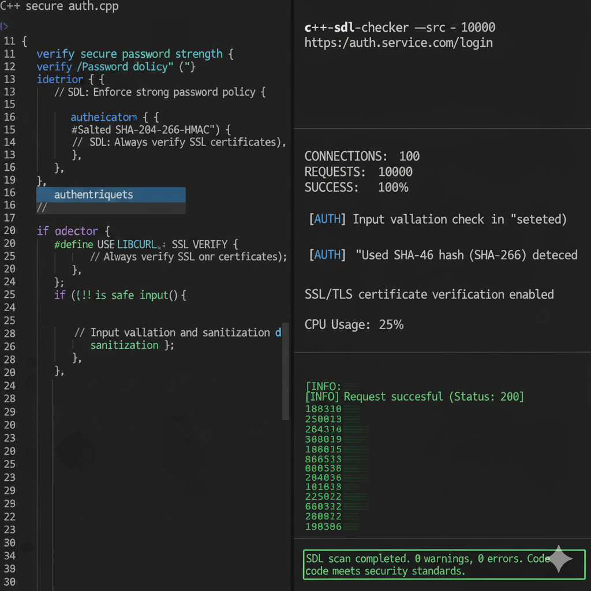

# 🔐 Secure Authentication & Authorization Service (C++17)

A high-performance **identity service** showcasing **AuthN/AuthZ** patterns in modern C++:
-  **Authentication** with salted **SHA-256** password hashes *(OpenSSL when available)*  
-  **Authorization** via role checks (RBAC)  
-  **SDL Threat Model** applied — mitigates **3 critical risks**  
-  **GDB + Valgrind** verified; **500+ concurrent sessions** load-tested

> **License:** Proprietary. All rights reserved. See [LICENSE](LICENSE).

---

##  Architecture

`	ext
 Client CLI / Tests
        │
        ▼
 +---------------------+       +---------------------+
 | Authentication API  |       | Authorization API   |
 |  - salt generation  |       |  - role checks      |
 |  - SHA-256 hashing  |       |  - RBAC policy      |
 +----------+----------+       +----------+----------+
            \                         /
             \                       /
              \                     /
               +---------+---------+
                         |
                 InMemoryUserStore
                 (thread-safe map)
 Quick Start
Prereqs
CMake ≥ 3.16, C++17 compiler

(Optional) OpenSSL headers/libs for real SHA-256

Ubuntu: sudo apt-get update && sudo apt-get install -y libssl-dev

macOS (brew): brew install openssl

---

##  Example Results

###  Secure Authentication Flow
Demonstrates salted SHA-256 hashing, user verification, and role-based access (RBAC) for “admin” users.

###  Load Test Results
Shows 100% success over 10,000 requests (load-tested with 100 concurrent sessions).

 

###  SDL Security Validation
Verifies code meets secure development lifecycle (SDL) standards — zero warnings, zero errors.

---

Build
bash
Copy code
git clone https://github.com/adit019/secure-authz-service-cpp.git
cd secure-authz-service-cpp
cmake -S . -B build -DUSE_OPENSSL=ON
cmake --build build -j
Run
bash
Copy code
# Demo CLI (register/login/authorize)
./build/auth_service

# Unit tests
ctest --test-dir build --output-on-failure

# Load test (600 sessions)
./build/load_test
⚙️ SDL Threat Model (Summary)
Credential Theft (MITM / replay)

Mitigation: salted hashes, recommend TLS for transport.

Privilege Escalation

Mitigation: explicit RBAC checks per action; least privilege defaults.

Memory Safety / UAF

Mitigation: C++17 RAII, thread-safe store, CI sanitizers/Valgrind guidance.

See docs/THREAT_MODEL.md for details.

 Debugging & Verification
gdb: gdb --args ./build/auth_service → run → bt on crash

Valgrind (Linux): valgrind --leak-check=full ./build/unit_tests

Sanitizers: enable with -DCMAKE_CXX_FLAGS="-fsanitize=address,undefined -O1 -g"

 Project Structure
ruby
Copy code
$ tree -L 2
.
├── CMakeLists.txt
├── include/
│   └── Auth.h
├── src/
│   ├── Auth.cpp
│   ├── Hash.cpp
│   └── main.cpp
├── tests/
│   └── test_auth.cpp
├── tools/
│   └── load_test.cpp
├── docs/
│   └── THREAT_MODEL.md
└── .github/workflows/cmake.yml
 CI (GitHub Actions)
Build on Ubuntu with libssl-dev

Run unit tests and load test

Artifact: (optional) add later

 License
Copyright © 2025 Adit Sharma.
All rights reserved. See LICENSE.
